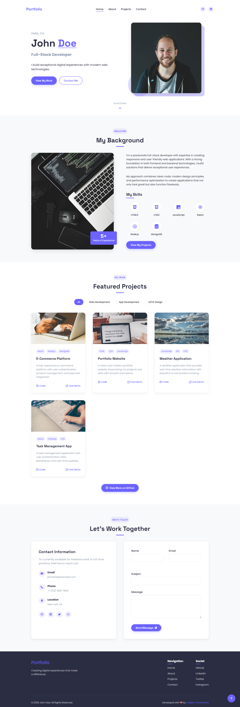

# Personal-Portfolio-Website

This is a Free Code Camp survey project for practicing Html, Css and JavaScript in the **Responsive Webdesign Curriculum.**



## Get Started

```bash
#First you need to clone this project
git clone https://github.com/Codeur-Omniscient/Personal-Portfolio-Website.git

#Change directory
cd Personal-Portfolio-Website
```

## Stack

- HTML
- CSS
- JAVASCRIPT

## Feature

- Sticky Navigation bar
- Link smooth animation
- Scroll Reveal Animation
